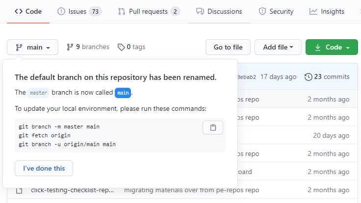

# Renaming the default branch from `master`

Many communities, both on GitHub and in the wider Git community, are considering renaming the default branch name of their repository from `master`. GitHub is gradually renaming the default branch of our own repositories from `master` to `main`. We're committed to making the renaming process as seamless as possible for project maintainers and all of their contributors. This repository is our up-to-date guidance on how and when to rename your default branch.

We're not the only organization in the Git ecosystem making these changes: there are upcoming changes in the Git project ([statement](https://sfconservancy.org/news/2020/jun/23/gitbranchname/), [code change](https://lore.kernel.org/git/pull.656.v4.git.1593009996.gitgitgadget@gmail.com/)), as well as coordinated changes from multiple vendors.

We're making changes to GitHub in a few phases, designed to cause as little disruption to existing projects as possible.

**If you haven't renamed your default branch yet, consider waiting until we've rolled out additional functionality to help with [renaming the default branch of an existing repository](#later-this-year). The goal is to be able to make it as seamless as possible for maintainers and contributors. Thanks to everyone providing feedback. We're testing additional capabilities on our own repositories and will continue rolling this out to everyone in January 2021.**

## What's already changed

- [We've updated GitHub.com](https://github.blog/changelog/2020-07-17-links-to-deleted-branches-now-redirect-to-the-default-branch/) to redirect links that contain the deleted branch name such as `master` to the corresponding link in the repository's new default branch.
- [We've updated GitHub Pages](https://github.blog/changelog/2020-07-31-build-and-deploy-github-pages-from-any-branch-beta/) to build and deploy from any branch.
  - Note: publishing to the special `gh-pages` branch will still work the same as it always has, but now you can choose any other branch in your repository as the publishing source.
- [We've added user, organization, and enterprise settings](https://github.blog/changelog/2020-08-26-set-the-default-branch-for-newly-created-repositories/) to set the default branch name for all newly-created repositories on GitHub.com. We're adding the same settings in the 3.0 release of GitHub Enterprise Server.
  - These settings cover repositories created through [GitHub.com](https://github.com/new) and the [GitHub API](https://developer.github.com/v3/guides/getting-started/#create-a-repository). Git 2.28 added a similar setting to control the default branch used when you run `git init` on the command line. Learn more about the new `init.defaultBranch` setting in [the Git 2.28 blog post](https://github.blog/2020-07-27-highlights-from-git-2-28/#introducing-init-defaultbranch).
  - [GitHub Desktop](https://desktop.github.com/) has introduced a default branch setting for new repositories.

## New repositories use `main` as default branch name

The default branch name for new repositories created on GitHub is now `main`. To set a different default:

1. For [users](https://docs.github.com/en/github/setting-up-and-managing-your-github-user-account/managing-the-default-branch-name-for-your-repositories), on the https://github.com/settings/repositories page
2. For [organization owners](https://docs.github.com/en/github/setting-up-and-managing-organizations-and-teams/managing-the-default-branch-name-for-repositories-in-your-organization), on the `https://github.com/organizations/YOUR-ORGANIZATION/settings/repository-defaults` page
3. For [enterprise administrators](https://docs.github.com/en/github/setting-up-and-managing-your-enterprise-account/enforcing-repository-management-policies-in-your-enterprise-account#enforcing-a-policy-on-the-default-branch-name), on the `https://github.com/enterprises/YOUR-ENTERPRISE/settings/member_privileges` page

Users, organizations, and enterprises that previously selected a default branch for new repositories are not impacted by this change. Existing repositories are also not impacted by this change.

#### Why main?

`main` is the most popular replacement for `master` that we're seeing across GitHub. We like it because it's short, it keeps your muscle memory intact, and it translates well across most languages. We're using `main` for our newly-created repositories and for the repositories we're moving now, like [dependabot-core](https://github.com/dependabot/dependabot-core).

## Creating a seamless move for existing repositories 🚀

For existing repositories, renaming the default branch today causes a set of challenges:

- Open pull requests need to be retargeted to the new branch
- Draft releases need to be retargeted to the new branch
- Branch protection policies need to be transferred to the new branch

Beginning in January 2021, we'll begin rolling out functionality to make it easier to rename the default branch of an existing repository:

Open pull requests and draft releases will be automatically retargeted, branch protection rules will be moved, and to help contributors, prompts will guide them on how to update their local configurations:

